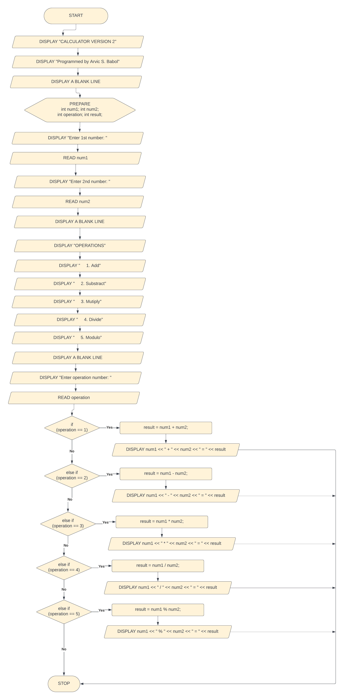

## CP1 | 2023-11-26
Calculator Version 2

### Flowchart


### C++ Source

#### Version 2
```cpp
#include <iostream>
#include <cstdlib>

using namespace std;

int main()
{
    // Display the header
    cout << "CALCULATOR VERSION 2" << endl;
    cout << "Programmed by [Your Name]" << endl;
    cout << endl;
    
    // Declare variables
    int num1, num2, operation, result;
    
    // Collect inputs	
    cout << "Enter 1st number: ";
    cin  >> num1;
    cout << "Enter 2nd number: ";
    cin  >> num2;
    
    // Display options
    cout << endl;
    cout << "OPERATIONS"      << endl;
    cout << "    1. Add"      << endl;
    cout << "    2. Subtract" << endl;
    cout << "    3. Multiply" << endl;
    cout << "    4. Divide"   << endl;
    cout << "    5. Modulo"   << endl;
    cout << endl;
    
    // Get operation
    cout << "Enter operation number: ";
    cin  >> operation;
    
    // Determine result
    if(operation == 1)
    {
        result = num1 + num2;
        cout << num1 << " + " << num2 << " = " << result << endl;
    }
    else if(operation == 2)
    {
        result = num1 - num2;
        cout << num1 << " - " << num2 << " = " << result << endl;
    }
    else if(operation == 3)
    {
        result = num1 * num2;
        cout << num1 << " * " << num2 << " = " << result << endl;
    }
    else if(operation == 4)
    {
        result = num1 / num2;
        cout << num1 << " / " << num2 << " = " << result << endl;
    }
    else if(operation == 5)
    {
        result = num1 % num2;
        cout << num1 << " % " << num2 << " = " << result << endl;
    }
    
    cout << endl << endl;
    system("PAUSE");
    return 0;
}
```

#### Version 5
```cpp
#include <iostream>
#include <cstdlib>

using namespace std;

int main()
{
    // Display the header
    cout << "CALCULATOR VERSION 5" << endl;
    cout << "Programmed by [Your Name]" << endl;
    cout << endl;
    
    // Declare variables
    double num1, num2, result;
    int operation;
    char symbol = ' '; // initialize symbol to whitespace symbol
    
    // Collect inputs	
    cout << "Enter 1st number: ";
    cin  >> num1;
    cout << "Enter 2nd number: ";
    cin  >> num2;
    
    // Display options
    cout << endl;
    cout << "OPERATIONS"      << endl;
    cout << "    1. Add"      << endl;
    cout << "    2. Subtract" << endl;
    cout << "    3. Multiply" << endl;
    cout << "    4. Divide"   << endl;
    cout << "    5. Modulo"   << endl;
    cout << endl;
    
    // Get operation
    cout << "Enter operation number: ";
    cin  >> operation;
    
    // Determine result
    if(operation == 1)
    {
        result = num1 + num2;
        symbol = '+';
    }
    else if(operation == 2)
    {
        result = num1 - num2;
        symbol = '-';
    }
    else if(operation == 3)
    {
        result = num1 * num2;
        symbol = '*';
    }
    else if(operation == 4)
    {
        if(num2 == 0)
        {
            cout << "Cannot divide by zero." << endl;
        }
        else
        {
            result = num1 / num2;
            symbol = '/';
        }
    }
    else if(operation == 5)
    {
        if((int) num2 == 0)
        {
            cout << "Cannot modulo by zero." << endl;
        }
        else
        {
            // cast or convert num1 and num2 to int
            // before applying modulos operation
            result = (int) num1 % (int) num2;
            symbol = '%';
        }
    }
    
    // only display result if symbol was changed
    if(symbol != ' ')
    {
        cout << num1 << " " << symbol << " " << num2 << " = " << result << endl;
    }
    
    cout << endl << endl;
    system("PAUSE");
    return 0;
}
```
